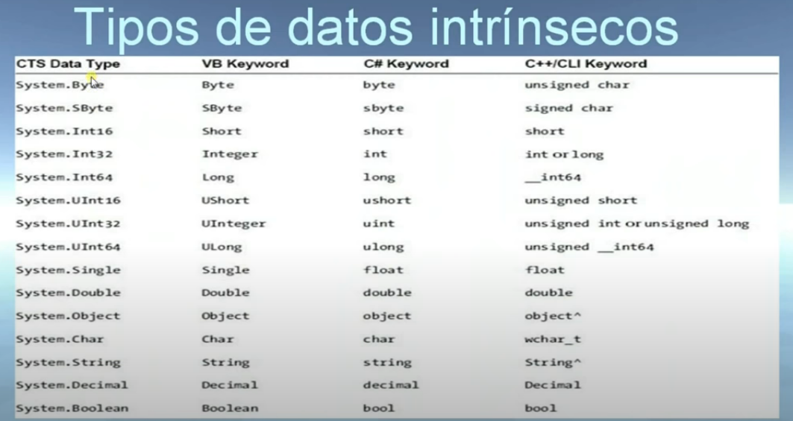

# C# INTERMEDIO -

## TEMAS
### INTERFACES
#### PROPIAS
#### LAS MAS IMPORTANTES DE .NET
### DELEGADOS
### SOBRECARGAS
### ARCHIVOS
### SERIAZILZACION.

### ANTES DE .NET
> La plataform empezo alrededor del 2002
antes se programaba usando el modelo COM - COMPONENT OBJECT MODEL
- PERMITIA CREAR LIBRERIAS QUE SE COMPARTIERAN EN VARIOS LENGUAJES
- ERA COMPLICADO
- FRAGIL
- Y SOLO SE USABA EN WINDOWS.
### BENEFICIOS DE .NET
> una forma mas flexible y poderosa que COM
sus caracteristicas principales
- interoperabilidad con codigo existente
- soporte para muchos lenguajes de programcion.
- un motor de runtime que es comun a todos los lenguajes que usan .NET
- integracion entre los lenguajes. cross-language code
- una libreria de clase base para brindar consistencia al modelo de objeto entre los lenguajes 
- un modelo de distribucion simplificado.

### ELEMENTOS QUE CONSTRUYEN A .NET

> CLR, CTS Y clase
.NET SE PUEDE VER COMO UN AMBIENTE DE EJECUCION Y  UNA LIBRERIA DE CLASE base
LA CAPA DE EJECUCION SE CONOCE COMO COMMON LANGUAGE RUNTIME O CLR 
- SU LABOR ES LOCALIZAR, CARGAR Y ADMININSTRAR POR NOSOTROS LOS OBJETOS  .NET
- ADMINISTRACION DE MEMORIA
- HOSPEDAR LA APLICACION
- COORDINAR LOS HILOS
- LLEVAR A CABO CHEQUEOS DE SEGURIDAD.

> COMMON TYPE SYSTEM O CTS
- DESCRIBE TODOS LOS TIPOS DE DATOS Y CONSTRUCCIONES QUE EL RUNTIME PUEDE SOPORTAR.
- ESPECIFICA COMO ESA ENTIDADES INTERACTUAN ENTRE SI
- ESPECIFICA COMO SON REPRESENTADAS EN EL FORMATO DE METADADOTS DE .NET
- NO TODOS  LOS LENGUAJES NECESARIAMENT IMPLEMENTAN TODAS LAS CARACTERISTICAS DEL CTS

> COMMON LANGUAGE SPECIFICATION O CLS
- DEFINE UN  SUBCONJUNTO DE LOS TIPOS Y CONSTRUCCIONES COMUNES QUE TODOS LOS LENGUAJES .NET TIENEN.
- SI SE USA ALGO QUE ESTA EN EL CLS, HAY GARANTIAS DE QUE EXISTE EN TODOS LOS DEMAS LENGUAJES.

## .NET Y C#
* LIBRERIA DE CLASE BASE
> ENCAPSULA VARIOS PRIMITIVOS, HILOS, IO, GRAFICAS , INTERACCION CON HARDWARE, SERVICIO, XML, PARA CONSTRUIR CUALQUIER TIPO DE APLICACION
> EN LO MAS PROFUNDO TENEMOS EL CLS, EN LA CAPA MEDIA EL CTS Y EL CLR EN LA PARTE MAS ARRIBA

* CARACTERISTICAS PRINCIPALES DE C#
> C# PERTENECE A LA FAMILIA DE C, Y TIENE UNA SINTAXIS SIMILAR A LOS LENGUAJES DE ESA FAMILIA
TIENE MUCHA PARTES QUE TIENEN INFLUENCIA DE VB. TAMBIEN PRESENTA ALGUNAS CARACTERISTICAS DE LOS LENGUAJES FUNCIONALES.
EL OBJETIVO ES HACER UN LENGUAJE CON UNA SINTAXIS MAS LIMPIA QUE JAVA SIMPLE COMO VB Y FLEXIBLE COMO C++. TENER LO MEJOR DE LOS LENGUAJES ANTERIORES.

CARACTERISTICAS PRINCIPALES DE C#
* NO HACE FALTA USAR APUNTADORES
* ADMINISTRACION DE MEROIA AUTOMATICA Y RECOLECTOR DE BASURA.
* CONSTRUCCIONES
 - CLASES
 - INTERFACES
 - ESTRUCTURAS
 - ENUMERACIONES
 - DELEGADOS.
* SOBRECARGA DE OPERADORES 
* PROGRAMACION BASADA EN ATRIBUTOS PARA DECORAR [SERIALIZE] [OBSOLETE]

# CARACTERISTICAS PRINCIPALES DE C# EN .NET 2.0
* SE PUEDEN CONSTRUIR TIPOS Y MIEMBROS GENERICOS
* SE PUEDE  USAR METEDOS ANONIMOS
* UN TIPO PUEDE SER DEFINIDO EN MULTIPLES DOCUMENTOS USANDO PARTIAL

# CARACTERISTICAS PRINCIPALES DE C# EN .NET 3.5
* SOPORTE PARA LINQ
* MAYOR SOPORTE PARA TIPOS ANONIMOS
* USO DE METODOS DE EXTENSION
* USO DEL OPERADOR LAMBDA

# CARACTERISTICAS PRINCIPALES DE C# EN .NET 4

* PARAMETROS OPCIONALES
* ARGUMENTOS NOMBRADOS
* MEJORA EN EL MANEJO DE TIPOS GENERICOS

# CARACTERISTICAS PRINCIPALES DE C# EN .NET 4.5
* SIMIPLIFICACION CON HILOS Y PROGRAMACION ASINCRONICA
* SIMPLIFICACION EN LA INVOCACION DE METODOS EN HILOS SECUNDARIOS

# CODIGO ADMINISTRADO
* ES CODOGI QUE SE EJECUTA EN EL RUNTIME DE .NET
* LA UNIDAD QUE CONTIENE EL CODIGO ADMINISTRADO SE LLAMA ASSEMBLY

.NET ES LENGUAJE -AGNOSTICO
NOS REFERIMOS A QUE EL SISTEMA NO ESTA CASADO CON NINGUN LENGUAJE EN PARTICULAR
* SI TODOS LOS LENGUAJES COMPILAN A CODIGO ADMININSTRADO, PORQUE NECESITAMOS MUCHOS LENGUAJES
- HAY MUCHAS PREFERENCIAS PERSONALE EN LOS PROGRAMADORES.
- SE APROVECHAN LOS PUNTOS  FUERTES EN CADA LENGUAJE
- UNA VEZ QUE SE APRENDE LA SINTAXIS EN UN LENGUAJE ES FACILL PASAR A OTRO.

# ASSEMBLY
> AUNQUE LOS ARCHIVOS BINARIOS DE .NET TIENEN LAS MISMAS EXTENSIONES QUE LOS NO ADMINISTRADOS, INTERNAMENTE NO SON SIMILARES.
* LOS BINARIOS DE .NET NO CONTIENEN INSTRUCCIONES QUE SEA ESPECIFICAS PARA ALGUNA PLATAFORMA
* CONTIENEN INTERMEDIATE LANGUAGE IL Y METADATOS RELACIONADOS CON LOS TIPOS
* IL, MSIL Y CIL SON EL MISMO CONCEPTO, PERO CIL ES MAS USADO PARA REFERIRSE A LAS INTSTRUCCIEONES DE BAJO NIVEL
* CUANDO UN DLL O EXE SE CREA EN .NET TENEMOS UN ASSEMBLY
* CONTIENE INSTRUCCIONES QUE SERAN USADAS POR EL RUNTIME DE .NET
* TAMBIEN CONTIENE METADATOS QUE DESCRIBEN TODOS LOS TIPOS USADOS EN  EL ASSEMBLY
 - CLASES, INTERFGACES, ETC.

* EL MANIFIESTO CONTIENE INFORMACIN
 - VERISON DEL ASSEMBLY
 - INFORMACION DE LOCALIZACION
 - INFORMACION SOBRE REFERENCIAS.

 # ENTENDIENDO CIL
 * CIL ES UN LENGUAJE QUE ESTA POR ARRBIA DE CUALQUIER INSTRUCCION QUE SEA ESPECIFICA PARA ALGUNA PLATAFORMA
 * BENEFICIOS DE CIL
  - INTEGRACION ETRE LOS LENGUAJES
  - .NET AL SER AGNOSTICO CON RELACION A LA PLATAFORMA TIENE LOS MISMOS BENEFICIOS QUE JAVA
* EL CODIGO CIL NECESITA SER COMPILADO EN EL MOMENTO ANTES DE USARSE, SE USA JIT
*JIT OPTIMIZA A LA PLATAFORMA DONDE SE VA USAR.

# METADATOS
* LOS METADATOS DAN INFORMACION SOBRE CADA TIPO QUE SE USA EN EL ASSEMBLY
* INTELLISENSE HACE USO DE LOS METADATOS 
* LAS HERRAMIENTAS DE DEBUG TAMBIEN HACEN USO DE LOS METADATOS.

# CTS
* UN TIPO ES UN MIEMBRO DE 
 - CLASE
 - INTERFACE
 - ESTRUCTURA
 - ENUMERACION
 - DELEGADO
* GENERALMENTE SOLO NOS INTERESA EL CTS SI CONSTRUIMOS HERRAMIENTSA O COMPILADORES PARA .NET

* CARACTERISTICAS IMPORTANES PARA EL CTS
- LA CLASE ESTA SELLADA O NOMBRADOS
- LA CLASE IMPLEMENTA INTERFACES O NO
- LA CLASE ES ABSTRACTA O CONCRETA
- EL TIPO DE VISIBILIDAD QUE TIENE

### CTS INTERFACE
* COLECCION DE DEFINICINOSE ABSTRACTAS DE MIEMBROS
* ES IMPORTANTE CONOCERLAS TAMBIEN POR QUE SON USADADAS PARA OPERACIONES POLIMORFICAS.

###  CTS STRUCTURE
* SON TIPOS DEFINIDOS POR EL PROGRAMADOR
* UNA HERENCIA DE C

### CTS ENUMERATION
* PERMITE CREAR GRUPOS DE PAREJAS NOMBRE-VALOR
* CREA UN TIPO QUE VA A TENER UN NUMERO FINITO DE VALORES
### CTS DELEGADOS
* SON EQUIVALENTES A LOS APUNTADORES A FUNCIONES DE CABO
* LA DIFERENCIA PRINCIPAL ES QUE SON CLASES
* SE USAN EN LA ARQUITECTURA DE EVENTOS .NET
### CTS TYPE MEMBERS
* LOS MIEMBROS EN CTS FORMAN PARTE DEL CONJUNTO QUE CONTIENE 
- CONSTRUCTOR.
- FINALIZADOR.
- CONSTRUCTOR ESTATICO.
- TIPOS ENLAZADOS.
- OPERADOR.
- METODO.
- PROPIEDAD.
- INDEXER.
- CONSTANTE.
- EVENTO.

# TIPOS Y NAMESPACES
* TIPOS DE DATOS INTRINSECOS
* NAMESPACES PRINCIPALES
* MICROSOFT ROOT NAMESPACES

## TIPOS DE DATOS INTRINSECOS
> EXISTE UN CONJUNTO DE TIPOS BIEN ESTABLECIDOS
* TODOS LOS LENGUAJES DE .NET TIENEN EN SUS TIPOS UNA EQUIVALENCIA A ELLOS.

# CLS
* EXISTEN FORMAS DIFERENTES DE EXPRESAR LO MISMO EN DIFERENTES LENGUAJES 
 - C# CONCATENAMOS CON +
 - VB CONCATENAMOS CON &
* NO SOLO SE DIFERENCIAN EN SINTAXIS, TAMBIEN PUEDEN SER DIFERENTES EN FUNCIONALIDADES.
* CLS, ES UNA SERIE DEREGLAS QUE DESCRIBE EL CONJUNTO MINIMO Y COMPLETO DE CARACTERISTICAS QUE UN COMPILADOR DE .NET DEBE TENER PARA PRODUCIR CODIGO QUE PUEDE USARSE EN EL CLR
* CADA UNA DE ESTAS REGLAS TINEN UN NOMBRE
* ES COMUN CREAR PROGRAMAS QUE ENADVERTIDAMENTE NO CUMPLAN CON CLS
* [ASSEMBLY: CLSCOMPILANT(TRUE)]

# CLR
* COLECCION DE SERVICIOS QUE SON REQUERIDOS  PARA EJECUTAR UNA UNIDAD DE CODIGO COMPILADORO
* .NET PROVEE UN RUNTIME QUE ES COMPARTIDO POR TODOS LOS LENGUAJES .NET.
* FISICAMENTE ES MSCOREEE.DLL(COMMON OBJECT RUNTIME EXECUTION ENGINE).
* TIENE VARIAS RESPONSABILIDADES
 - RESUELVE LA LOCACION Y LOS TIPOS
 - COMPILA EL CIL EN INSTRUCCIONES ESPECIFICAS PARA LA PLATAFORMA
 - LLEVA A CABO VERIFICAICONES DE SEGURIDAD.
 - EJECUTA EL CODIGO.

 # NAMESPACES
 * LAS BIBILIOTECAS NOS PERMITEN TENER CODIGO QUE PODEMOS USAR EN NUESTRAS APLICACIONES.
 * EL NAMESPACES ES UN AGRUPAMIENTO DE TIPOS RELACIONADOS CONTENIDOS EN UN ASSEMBLY Y QUE SE PUEDE EXTENDER A VARIOS.
 * UN ASSEMBLY PUEDE CONTENER VARIOS NAMESPACES.
 * LOS PODEMOS USAR PARA AGRUPAR LOGICAMENTE TIPOS QUE ESTAN RELACIONADOS ENTRE SI.

 # NAMESPACES MAS IMPORTANTES
 * SYSTEM => TIPOS, MATEMATICAS, ALEATORIO, VARIABLES DE AMBIENTE, RECOLECCION DE BASURA , EXCEPCIONES, ETC
 * SYSTEM.COLLECTION, SYSTEM.COLLECTIONS.GENERIC
  - TIPOS PARA COLECCIONES E INTERFACES PARA CONSTRUIR COLECCIONES PROPIAS.

* SYSTEM.DATA, SYSTEM.DATA.COMMON, SYSTEM.DATA.ENTITYCLIENT, SYSTEM.DATA.SQLCLIENT
- SE USAN PARA INTERACTUAR CON BASES DE DATOS RELACIONALES.

* SYSTEM.IO, SYSTEM.IO.COMPRESSION, SYSTEM.IO.PORTS
- TIPOS USADOS PARA EL MANEJO DE ENTRADAS Y SALIDAS A ARCHIVOS, COMPRESION DE DATOS Y MANIPULACION DE LOS PUERTOS.

* SYSTEM.REFLECTION, SYSTEM.REFLECTION.EMIT
- PARA CREACION DINAMICA DE TIPOS

* SYSTEM.RUNTIME.INTEROPSERVICES
- FACILITA A LOS TIPOS DE .NET INTERACCION CON CODIGO NO ADMINISTRADO

* SYSTEM.DRAWING, SYSTEM.WINDOWS.FORMS
- USADOS PARA CONSTRUIR APLICACIONES DE WINDOWS FORMS

* SYSTEM.WINDOWS, SYSTEM.WINDOWS.CONTROLS, SYSTEM.WINDOWS.SHAPES
- USADOS PARA WPF E INTERFAZ DE USUARIO.

* SYSTEM.LINQ, SYSTEM.XML.LINQ, SYSTEM.DATA.DATASETEXTENSION
- USADOS PARA TRABAJAR CON EL API DE LINQ

* SYSTEM.WEB
- PARA CONSTRUIR APLICACIONES ASP .NET

* SYSTEM.SERVICEMODEL
- PARA CONSTRUIR APLICACIONES DISTRIBUIDAS WCF

* SYSTEM.WORKFLOW.RUNTIME, SYSTEM.WORKFLOW.ACTIVITIES
- SE USAN PARA TRABAJAR CON EL API DE WINDOWS WORKFLOW FOUNDATION

* SYSTEM.THREADING, SYSTEM.THREADING.TASTKS
- PARA CONSTRUIR APLICAICONES QUE USEN MULTIPLES HILOS O QUE DISTRIBUYAN LA CARGA DE TRABAJO ENTRE VARIOS CPUS

* SYSTEM.SECURITY
- TIPOS RELACIONADOS CON PERMISOS, CRIPTOGRAFIA, ETC

* SYSTEM.XML
- USADO PARA INTERACTUAR CON DATOS EN FORMATO XML.

# MICROSOFT ROOT NAMESPACES
* LOS NAMESPACES QUE EMPIEZAN CON MICROSOFT CONTIENEN TIPOS QUE SE USAN PARA TRABAJAR E INTERACTUAR CON SERVICIOS DEL SISTEMA OPERATIVO DE WINDOWS
* MICROSOFT.CSHARP
* MICROSOFT.WIND32
* NO HAY GARANTIA DE QUE ESTOS NAMESPACE FUNCIONEN EN OTROS SISTEMAS OPERATIVOS.

# ACCESO A LOS NAMESPACE
* EN C# USAMOS EL 'USING' PARA REFEENCIAR UN TIPO EN NAMESPACE PARTICULAR
* TAMBIEN SE PUEDE USAR EL NOMBRE COMPLETAMENTE CUALIFICADO
- SYSTEM.WINDOWS.CONTROLS.BUTTON
- SYSTEM.CONSOLE.WRITELINE
* EN MUCHOS CASOS ES NECESARIO USAR REFERENCIAS A ASSEMBLIES EXTERNOS.
* LA MAYORIA DE LOS ASSEMBLIES EN .NET SE ENCUENTRAN EN GLOBAL ASSEMBY CACHE(GAC)
 - C:\WINDOWS\ASSEMBLY

# ILDASM
* UTILERIA PARA VER CONTENIDOS DEL ASSEMBLY
* COLOCAR HERRAMIENTAS EN VS
* USO DE LA UTILERIA

LDASM -> INTERMEDIATE LANGUAGE DISSASSEMBLER, ES UNA UTILERIA QUE PERMITE VER LOS ASSEMBLIES Y LEER SUS CONTENIDOS.
- MANIFIESTO
- CIL
- METADADOS

* CONFIGUARACION DE HERRAMIENTAS EXTERNAS PARA VISUAL STUDIO.
 - EXTERNAL TOOLS
 DESDE EL COMMAND PROMPT PONEMOS : LLDASM.EXE

 # .NET ES INDEPENDIENTE DE LA PLATAFORMA
 LOS ASSEMBLIES DE .NET PUEDEN SER EJECUTADOS EN MUCHO SISTEMAS OPERATIVOS.
 - MAC OSX
 - LUNIX
 - SOLARIS 
 - IOS
 - ANDROID

* ESTO ES GRACIAS AL CLI COMMON LANGUAGE INFLAESTRUCTURE
* EXISTEN DOCUMENTOS QUE DEFINEN LA SINTAXIDS Y SEMANTICA DE C# Y CIL, EL FORMATO DE LOS ASSEMBLIES, LOS NAMESPACES Y LA FORMA COMO TRABAJA EL NAMESPACE.
* ESTOS DOCUMENTOS SON RATIFICADOS POR ECMA INTERNATIONAL 
- ECMA -334 PARA C#
- ECMA -335 PARA COMMON LANGUAGE INFRAESTRUCTURE
* MONO Y ODTGNU HACEN USO DE ESTOS DOCUMENTOS PARA CREAR SUS HERRAMIENTAS.
